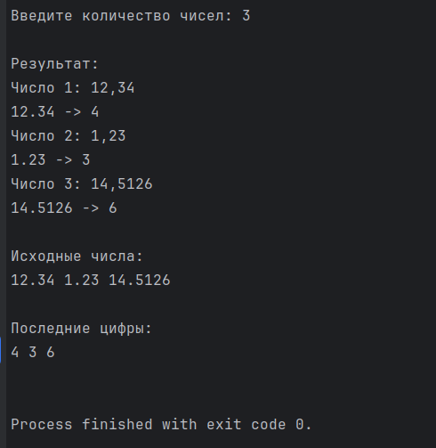
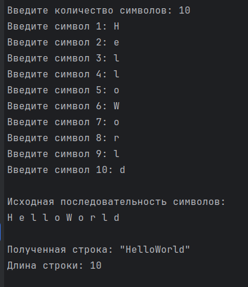
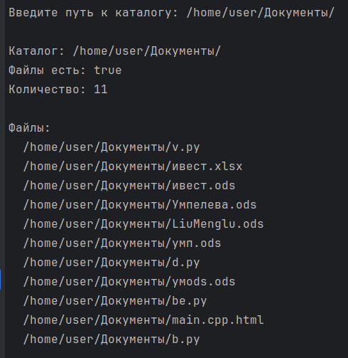

# Красных Александр ИТС-2 Лабораторная №1

# Задание 1

### Текст задачи

Решить задачу из лабораторной работы №2 (Задание 1. List.map) для
последовательности

### Алгоритм решения

1. Берем за основу наш код из прошлой работы и смотрим, что можно из него оставить, а что еще пригодится.
2. Оставляем проверку вводимых значений, остальное же меняем под правила последовательности.
3. Нашей программе теперь предстоит работать не со списками, а с последовательностью. Это значит, что тут
в игру вступят линивые переменные и отложенные вычисления для того что бы можно было грамотно вычислять искомые
значения.
4. Прописываем функцию для создания отложенной последовательности, а так же изменяем функцию getLastDigit,
теперь она работает для последовательности.
5. Теперь прописываем основную программу с пользовательским интерфейсом и инициализацией последовательности. В
ней будут задаваться значения для последовательности и вызываться основные функции.
6. Проверяем работу программы.

### Тестирование

# Задание 2

### Текст задачи

Решить задачу из лабораторной работы №2 (Задание 2. List.fold) для
последовательности

### Алгоритм решения

1. Алгоритм здесь точно такой же как в прошлом задании. Берем основу ввиде кода с нашей прошлой работы и ищем,
что здесь нам пригодится.
2. Переписываем оставшееся для работы с последовательностью все также используя ленивые вычисления для
корректных результатов.
3. Переписываем основную программу под наши новые запросы.
4. Тестируем готовый код.

### Тестирование

# Задание 3

### Текст задачи

Выяснить, есть ли файлы в указанном каталоге

### Алгоритм решения

1. Здесь уже задачка поинтереснее. Для начала начнем с работы с директориями системы.
2. Пропишем функцию для нахождения директории под название getDir. Данная функция будет
искать директорию в систему и выдывать ошибку в случае не нахождения или передевать
сведения о ней если нашла.
3. Далее записываем наши файлы в директории (если они есть) из последовательности в массив.
4. Используем ленивые вычисления для создания нашей итоговой последовательности файлов.
5. Наконец выводим количество файлов и их названия если файлы есть.
6. Тестируем программу.

### Тестирование

